<div align="center">

# 📬 Email Dispatch Scheduler

**A distributed, rate-limited email scheduling system that survives restarts, never double-sends, and tells you when it's throttled.**


[Quick Overview](#-quick-overview) · [Architecture](#-architecture) · [How It Works](#-how-it-works) · [Reliability](#-reliability-and-restart-safety) · [Run Locally](#-run-it-locally) · [API](#-api-reference)

</div>

---

## 🎯 Quick Overview

> **In one sentence:** you upload a list of leads, pick a start time, and the system sends each email at the right moment, at a safe speed, without ever losing or duplicating a job, even if servers crash.

| Problem | How this project solves it |
|---|---|
| Sending thousands of emails at once gets accounts blocked | **Two-tier rate limiting**: minimum gap between emails and an hourly cap per sender |
| Servers restart and scheduled emails get lost | **PostgreSQL + Redis persistence**; jobs resume automatically |
| Retries cause duplicate emails | **Idempotency keys** plus **distributed locks** |
| One busy sender blocks everyone else | Only the **affected sender's** jobs are delayed, not the whole queue |
| Users don't know why sending paused | **Slack alert** with the exact resume time |
| Finding a past email is slow | **Fuzzy full-text search** with automatic database fallback |

###  Highlights

-  **TypeScript end-to-end**: frontend, API server and background worker are all written in TypeScript
-  **Delayed scheduling** with millisecond precision (BullMQ + Redis)
-  **Atomic rate limiting** using a Redis Lua script (no race conditions)
-  **Exactly-once processing** via idempotent job IDs and NX locks
-  **Crash-safe**: API and worker are separate, stateless where it counts
-  **Elasticsearch search** that gracefully falls back to PostgreSQL
-  **Slack alerts** with hourly de-duplication
-  **Bull Board** for live queue monitoring
-  **Auth**: email/password (bcrypt + JWT cookies) and Google OAuth 2.0

---

## 🟦 Built with TypeScript, End to End

TypeScript is a core requirement of this project. Every runtime piece is written in it, so one language and one toolchain cover the UI, the API and the background worker.

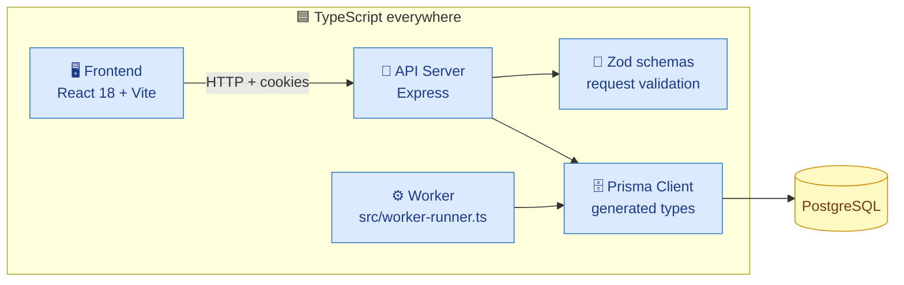

| Where | TypeScript usage |
|---|---|
| **Frontend** | React 18 + Vite + Tailwind, written as TypeScript components |
| **API server** | Express 4 in TypeScript 5, run in development with `tsx` |
| **Worker** | `src/worker-runner.ts`, a standalone BullMQ worker process |
| **Database access** | Prisma ORM generates a typed client from the schema |
| **Input validation** | Zod schemas validate every scheduling request payload |

---

## 🏗 Architecture

The **API server** accepts requests and schedules jobs. A **separate worker process** actually sends emails. They only talk through Redis and PostgreSQL, so either can restart without affecting the other.

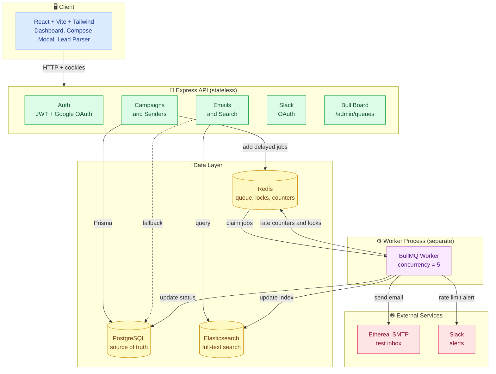

---

## 🔄 How It Works

### 1. From "Schedule" click to delivered email

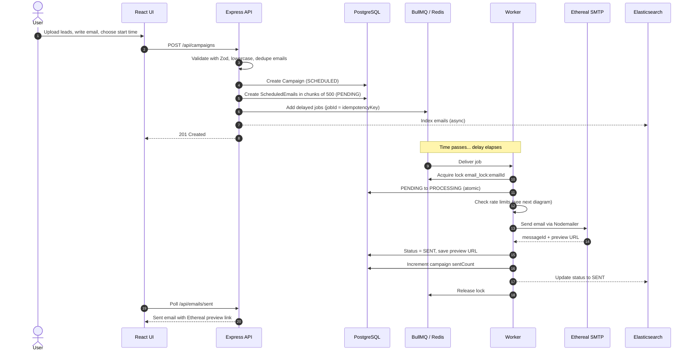

### 2. Life of a single email (status flow)

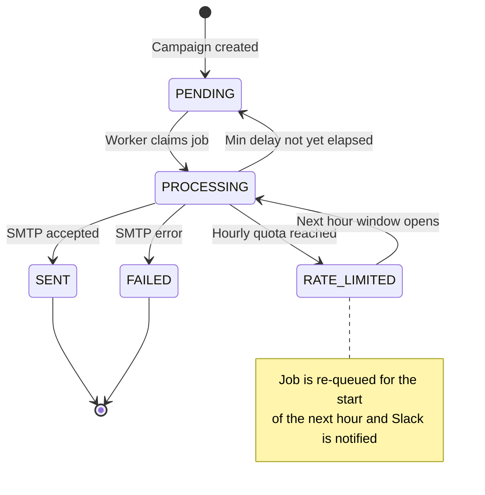

### 3. Rate limiting decision flow

Every job passes through two gates before an email is allowed out.

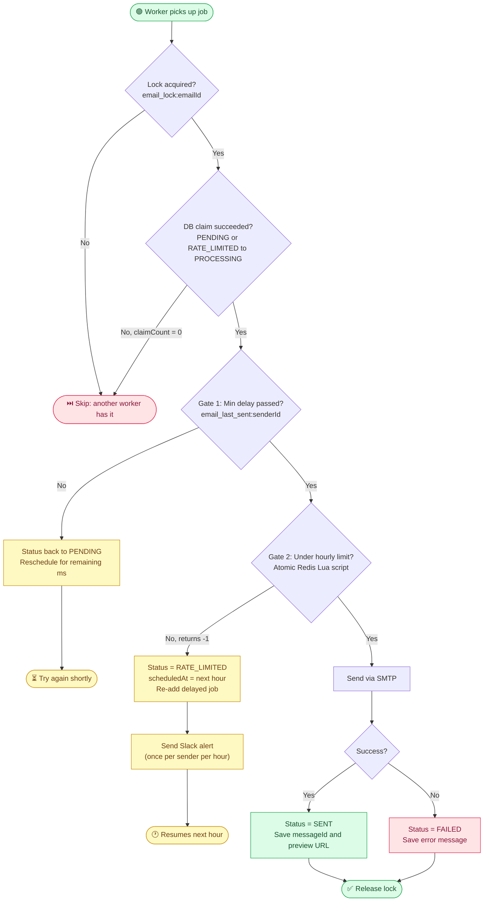

<details>
<summary><b>🔬 See the atomic Lua script behind Gate 2</b></summary>

The check and the increment happen in a single atomic step inside Redis, so two workers can never both squeeze past the limit.

```lua
local current = redis.call('GET', KEYS[1])
if current and tonumber(current) >= tonumber(ARGV[1]) then
  return -1
else
  local count = redis.call('INCR', KEYS[1])
  if count == 1 then
    redis.call('EXPIRE', KEYS[1], 7200)
  end
  return count
end
```

</details>

### 4. Why only one sender gets delayed

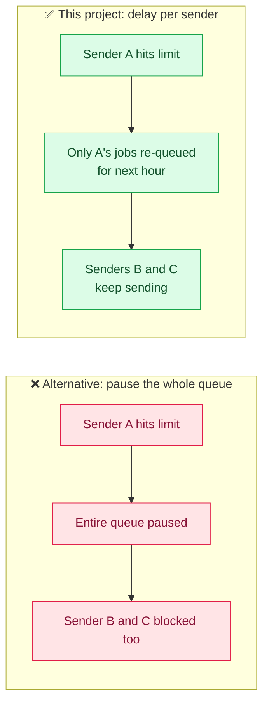

---

## 🛡 Reliability and Restart Safety

Restart persistence is a **core requirement**, not an afterthought.

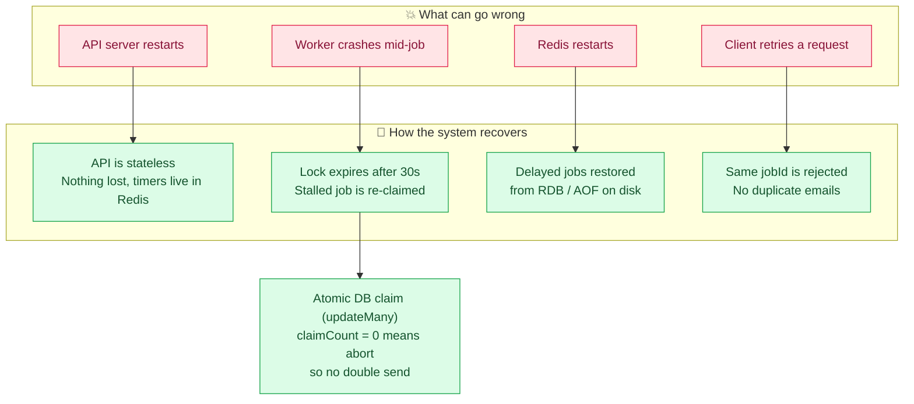

| Guarantee | Mechanism |
|---|---|
| **No lost jobs** | Delayed jobs live in Redis sorted sets (persisted via RDB/AOF); PostgreSQL is the source of truth |
| **No duplicate jobs** | `jobId = idempotencyKey`, enforced unique in the database and by BullMQ |
| **No double processing** | Redis `NX` lock with TTL plus atomic `updateMany` claim in PostgreSQL |
| **No queue bloat** | Only the latest 1,000 completed and failed jobs are retained |
| **Safe dev tooling** | `npm run queue:clear` is manual only, never run on startup |

---

##  Search with Graceful Fallback

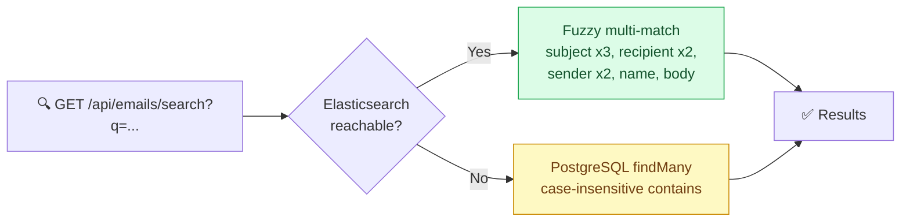

Users never see an error just because Elasticsearch is down. Search keeps working transparently.

---

## 🔔 Slack Rate-Limit Alerts

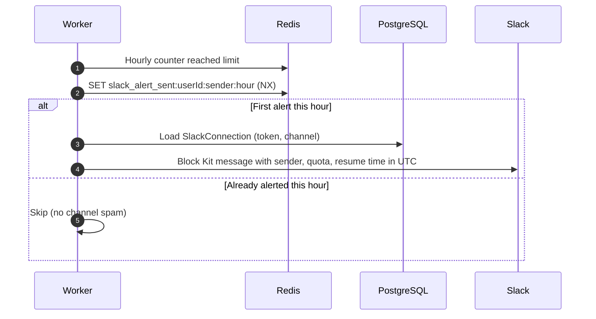

---

## 🔐 Authentication

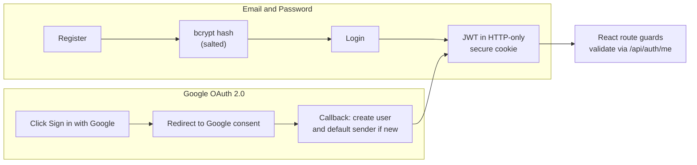

---

## 🗄 Data Model (simplified)

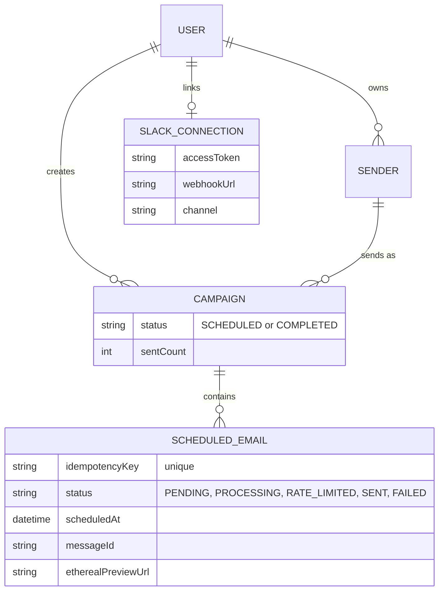

---

##  Key Engineering Decisions

| Decision | Why |
|---|---|
| **TypeScript across every layer** | One language for UI, API and worker; typed database access via Prisma and validated inputs via Zod catch mistakes early |
| API and worker are **separate processes** | Restarting or scaling one never disrupts the other |
| **Lua script** for hourly counters | Check-and-increment is atomic, so no race conditions across concurrent workers |
| **Per-sender delay** instead of pausing the queue | Fair to unrelated senders; better throughput |
| **Idempotency key as BullMQ `jobId`** | Network retries can't create duplicates |
| **PostgreSQL as source of truth**, Redis as scheduler | Queue data can be rebuilt; business state can't be lost |
| **Elasticsearch optional** | Reduces setup friction; app degrades gracefully instead of failing |
| **Ethereal SMTP** | Safe, real SMTP behavior with a browser preview link and no risk of emailing real people |

---

## 🧰 Tech Stack

| Layer | Technology |
|---|---|
| **Language** | **TypeScript 5** across frontend, backend and worker |
| **Frontend** | React 18, Vite 6, TypeScript, Tailwind CSS 3, Lucide React |
| **Backend** | Node.js, Express 4, TypeScript 5, tsx |
| **Database** | PostgreSQL with Prisma ORM 6 |
| **Queue** | BullMQ 5 on Redis 7+ (`ioredis`) |
| **Email** | Nodemailer with Ethereal SMTP |
| **Search** | Elasticsearch 8.x (PostgreSQL fallback) |
| **Auth** | JWT (HTTP-only cookies), bcryptjs, Google OAuth 2.0 |
| **Integrations** | Slack OAuth 2.0 (Block Kit alerts) |
| **Monitoring** | Bull Board (`@bull-board/express`) |

---

## 🖥 Feature Details

<details>
<summary><b> Lead parsing and deduplication</b></summary>

- Upload `.csv` or `.txt`, or paste emails directly
- Lowercases and trims every address
- Validates with an RFC-compliant regex
- Removes duplicates
- Modal reports **valid**, **duplicates removed**, and **invalid** counts before you submit

</details>

<details>
<summary><b>⏱ Scheduling controls</b></summary>

- **Start time:** send now, pick a date and time, or use presets like "Tomorrow morning"
- **Inter-email delay:** minimum gap between emails (default 2 seconds)
- **Hourly limit:** max emails per sender per sliding hour (default 200)

</details>

<details>
<summary><b> Dashboard</b></summary>

- **Scheduled** and **Sent** tabs with live counters and auto-polling
- Message viewer with subject, sender, recipient, status, errors, full HTML body, and Ethereal preview link
- Slack modal to check status, connect, or disconnect

</details>

<details>
<summary><b>📡 Monitoring</b></summary>

Bull Board at `/admin/queues` shows active, waiting, completed, failed, and delayed jobs, with payloads and failure stack traces.

</details>

---

##  Run It Locally

### Prerequisites

| Requirement | Version |
|---|---|
| Node.js | 20.x or 22.x |
| npm | 10+ |
| PostgreSQL | 14+ (port 5432) |
| Redis | 7+ (port 6379) |
| Elasticsearch | 8.x on port 9200 (*optional*) |

### 1. Clone

```bash
git clone <repository-url>
cd email
```

### 2. Backend

```bash
cd backend
npm install
```

Create `backend/.env`:

```env
PORT=4002
NODE_ENV=development

DATABASE_URL=postgresql://<DB_USER>:<DB_PASSWORD>@localhost:5432/<DB_NAME>?schema=public
REDIS_URL=redis://localhost:6379
ELASTICSEARCH_URL=http://localhost:9200

FRONTEND_URL=http://localhost:5174
BACKEND_URL=http://localhost:4002

JWT_SECRET=your_jwt_secret_key
COOKIE_SECRET=your_cookie_secret_key

# Google OAuth 2.0
GOOGLE_CLIENT_ID=your_google_client_id.apps.googleusercontent.com
GOOGLE_CLIENT_SECRET=your_google_client_secret
GOOGLE_CALLBACK_URL=http://localhost:4002/api/auth/google/callback

# Slack Integration
SLACK_CLIENT_ID=your_slack_client_id
SLACK_CLIENT_SECRET=your_slack_client_secret
SLACK_REDIRECT_URI=http://localhost:4002/api/slack/callback

# Ethereal SMTP (leave user/password blank to auto-generate test credentials)
ETHEREAL_HOST=smtp.ethereal.email
ETHEREAL_PORT=587
ETHEREAL_USER=
ETHEREAL_PASSWORD=

# Worker and limits
WORKER_CONCURRENCY=5
MIN_EMAIL_DELAY_SECONDS=2
MAX_EMAILS_PER_HOUR_PER_SENDER=200
```

Initialize the database and start the API:

```bash
npm run prisma:generate
npm run prisma:push
npm run dev
```

Start the worker in a **second terminal**:

```bash
cd backend
npx tsx src/worker-runner.ts      # or: npm run build && npm run start:worker
```

Optional: clear the queue for a fresh test run.

```bash
npm run queue:clear
```

### 3. Frontend

```bash
cd ../frontend
npm install
npm run dev
```

### 🔗 App URLs

| Service | URL |
|---|---|
| Frontend dashboard | http://localhost:5178 |
| Backend health check | http://localhost:4002/health |
| Bull Board | http://localhost:4002/admin/queues |

---

##  API Reference

<details>
<summary><b> Authentication</b></summary>

| Method | Endpoint | Description |
|---|---|---|
| `POST` | `/api/auth/register` | Create account (email, password, name) |
| `POST` | `/api/auth/login` | Login and set JWT cookie |
| `POST` | `/api/auth/logout` | Clear auth cookie |
| `GET` | `/api/auth/me` | Get current session |
| `GET` | `/api/auth/google` | Redirect to Google consent screen |
| `GET` | `/api/auth/google/callback` | Google OAuth callback |

</details>

<details>
<summary><b> Senders</b></summary>

| Method | Endpoint | Description |
|---|---|---|
| `GET` | `/api/senders` | List sender identities for the current user |
| `POST` | `/api/senders` | Register a sender (name, email, SMTP credentials) |

</details>

<details>
<summary><b> Campaigns and scheduling</b></summary>

| Method | Endpoint | Description |
|---|---|---|
| `POST` | `/api/campaigns` (or `/api/schedules`) | Create and schedule a campaign |
| `GET` | `/api/campaigns` | List campaigns with live delivery progress |
| `POST` | `/api/campaigns/parse-leads` | Parse and validate a recipient list (file or text) |

</details>

<details>
<summary><b> Emails</b></summary>

| Method | Endpoint | Description |
|---|---|---|
| `GET` | `/api/emails/scheduled` | Paginated `PENDING` and `RATE_LIMITED` emails |
| `GET` | `/api/emails/sent` | Paginated `SENT` and `FAILED` emails |
| `GET` | `/api/emails/counts` | Live totals for scheduled and sent |
| `GET` | `/api/emails/search?q=...` | Search (Elasticsearch with PostgreSQL fallback) |
| `GET` | `/api/emails/:id` | Full details, preview URL, and error logs |

</details>

<details>
<summary><b> Slack</b></summary>

| Method | Endpoint | Description |
|---|---|---|
| `GET` | `/api/slack/connect` | Get the Slack OAuth authorization URL |
| `GET` | `/api/slack/callback` | Exchange code and link workspace |
| `GET` | `/api/slack/status` | Check whether Slack alerting is active |
| `POST` | `/api/slack/disconnect` | Unlink Slack |

</details>

---

## ⚠️ Known Limitations

1. **OAuth credentials required.** Google and Slack integrations need OAuth apps registered in their developer consoles. With empty credentials, those endpoints return descriptive configuration errors.
2. **Elasticsearch is optional.** It is fully integrated, but if it is offline the app falls back to PostgreSQL case-insensitive queries.
3. **Test SMTP by design.** Delivery uses Ethereal rather than production providers (SendGrid, SES, Mailgun). Real SMTP credentials can be configured per sender.
4. **Manual queue cleanup.** `npm run queue:clear` is a development-only command and never runs automatically, so jobs persist across restarts.

---

<div align="center">


</div>
